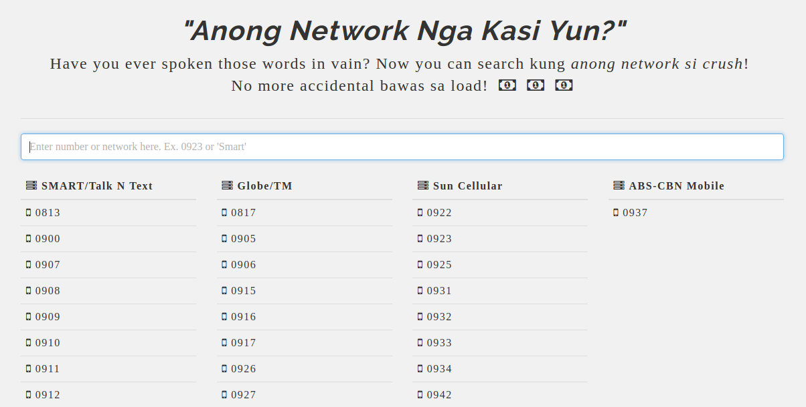

# Anong Network Nga Kasi Yun?

  <i>Does 0919 even exists?</i>

## Usage

The carriers with its number prefixes are already populated on page load. Entering a number prefix *(ex. 0923)* or a string for a carrier name *(ex. Smart)* will filter the tables. Any change in your input is automatically detected and the result is updated accordingly.

## License

The contents of this repository is under the following license(s):

* MIT License